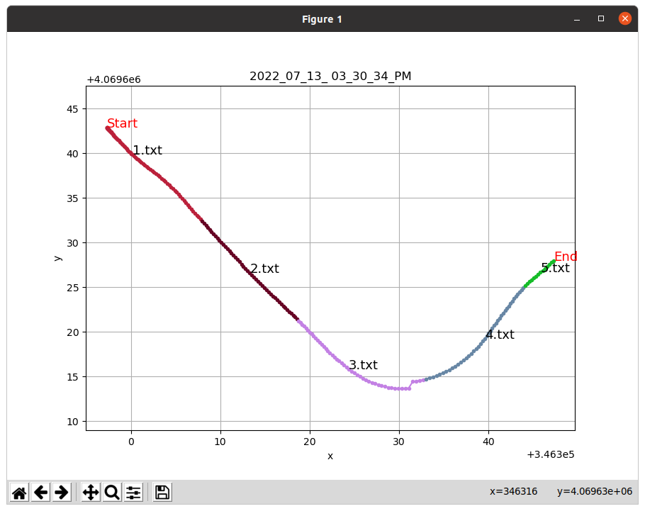
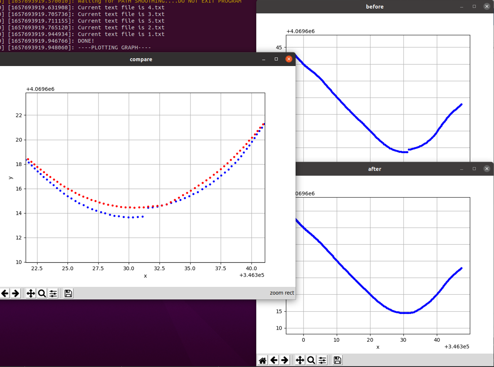

# Kalman Filter Using Non-Linear Bicycle Model
### System Modeling
Using Bicycle Model
reference : https://github.com/Derekabc/PathTrackingBicycle
# Input
### 1. ERP-42 
| Data | Topic Name | Msg Type | Hz|
| ------ | ------ | ------ | ------ |
| **Current Front Steering Angle** | /erpData/steer | control_to_serial/fromERP |17.5 |
|**Current Vehicle Speed**| /erpData/speed | control_to_serial/fromERP |17.5 |

### 2. GPS, IMU
| Data | Topic Name | Msg Type | Hz|
| ------ | ------ | ------ | ------ |
| **GPS Odometry** | /odom | nav_msgs/Odometry| 8|
| **GPS Heading** | /current_yaw | std_msgs/Float64 |8 |
|**IMU**| /imu | sensor_msgs/Imu | 62.5|

# Output
### ROS
| Data | Topic Name | Msg Type | Hz|
| ------ | ------ | ------ | ------ |
| **Kalman Filtered Pose & orientation** | /LOCAL/kalmanFiltered | geometry_msgs/Pose2D| 62.5|

### In code
**[x, y, yaw, vx, vy, omega]^T**
> **Note** : in c++ Node use getStates() function to get vehicle current STATE

# Tools
### 1. txt_saver_for_kcity

### 2. path_smoothing
> **Note** : **If you plan to use c++ code and use map option, Make sure to do "path_smoothing" to your map**


### 3. coord_trans


# Before execute
> **Note** : **Make sure to run codes below**

###  0. ERP Control Node (/dev/ttyUSB0)
```sh
rosrun control_to_serial Serial
```
###  1. GPS (/dev/ttyUSB1)
Run GPS codes
```sh
rosrun nmea_navsat_driver nmea_serial_driver
rosrun nmea_vtg_reader heading_using_vector
rosrun gps_common utm_odometry_node
```
### 2. IMU (/dev/ttyUSB2)

Run IMU code
```sh
rosrun razor_imu_9dof imu_node.py
```
> **Note** : **The IMU sensor must be attached to the center of the vehicle, and pay attention to the direction of the IMU sensor coordinate system.**

# How to execute
### Python
```sh
rosrun kbub_localization kbub_localization.py
```
or
```sh
cd {your_workspace}/src/kbub_localization
cd src
python3 kbub_localization.py
```
> **Note** : **Before execute, Make sure to Change the permission** -> "sudo chmod +x"

### C++
```sh
rosrun kbub_localization localization
```

## References
1. Bicycle Model & Kalman Filter Paper
   --> https://escholarship.org/content/qt3v08d6nt/qt3v08d6nt.pdf
2. Bicycle Model Python Github
   --> https://github.com/Derekabc/PathTrackingBicycle
3. Extended Kalman Filter Open-source Code (Python Robotics)
   --> https://github.com/AtsushiSakai/PythonRobotics/blob/master/Localization/extended_kalman_filter/extended_kalman_filter.py
4. What is the Linear Kalman Filter ?
   --> https://gaussian37.github.io/ad-ose-lkf_basic/
5. What is the Covariance ?
   --> https://hsm-edu.tistory.com/1266
6. How did i solve the problem of different Sensor update speed?
   --> https://www.koreascience.or.kr/article/JAKO201411560023074.pdf
   

## TODO
1. Check Sensor Data whether properly synchronized or not.  -> **Ok**
2. Check if there is the **time delay** when compared to real-time movement.  -> **Ok**
3. Change to C++ using Eigen  -> **Ok**
4. Make the roslaunch file to run it at once 
 
